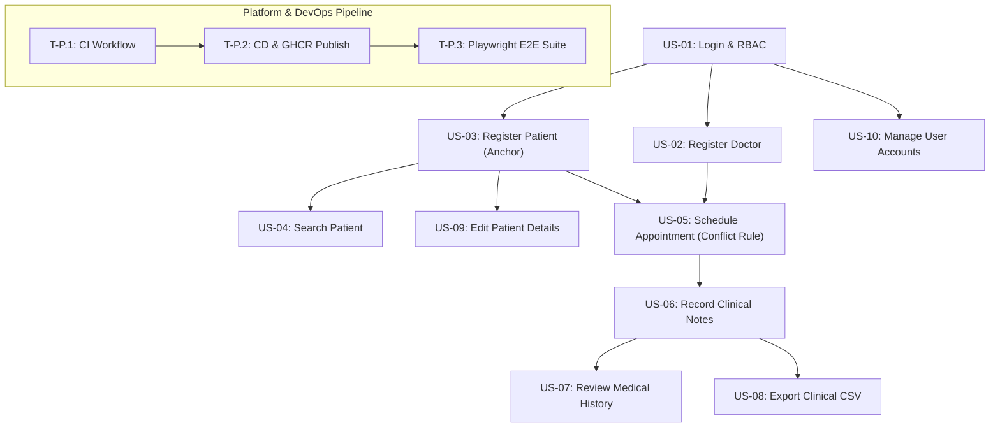
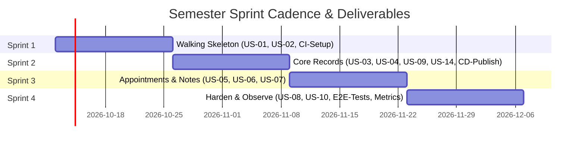

# Hospital Management — DevOps Project

## 1. Project overview

This project delivers a streamlined **Hospital Administration Web Application** designed to manage core healthcare operational workflows, including patient administration, doctor scheduling, appointment lifecycle management, and consultation records under role-based access control.

> **Key Architectural Principle:** The hospital web application serves as a functional vehicle; the **automated DevOps delivery pipeline is the primary deliverable**.

The system is developed and graded on the establishment of an automated, resilient engineering pipeline encompassing:

- **GitHub Issues & Projects:** Transparent backlog management, task decomposition, and Definition of Done (DoD) tracking.
- **GitHub Actions (CI/CD):** Continuous Integration automating code linting, unit testing, and end-to-end integration tests on every pull request.
- **GitHub Container Registry (GHCR):** Automated container build, tagging, and publication triggered whenever verified changes merge into the `main` branch.

---

## 2. Requirement analysis

### 2.1 Functional requirements

The system implements functional capabilities organized across six core domain groups derived from the operational scenario.

#### Group 1: Patients

- **FR-01 (Patient Registration):** The system shall allow receptionists and administrators to register new patients with mandatory attributes: full name, date of birth, and contact details.
- **FR-02 (Patient Search & Profile):** The system shall allow receptionists and administrators to search for patients by full name or national identification number and display their demographic details.
- **FR-03 (Patient Record Modification):** The system shall allow receptionists and administrators to update existing patient demographic and contact information.
- **FR-04 (Patient Deactivation):** The system shall allow receptionists and administrators to deactivate a patient record while preserving all past appointments and medical history (soft deactivation; records are never purged).

#### Group 2: Doctors

- **FR-05 (Doctor Registration):** The system shall allow administrators to register medical doctors specifying their name, clinical specialisation, contact information, and availability windows.
- **FR-06 (Doctor Profile & Availability Update):** The system shall allow administrators to modify a doctor's profile, clinical specialisation, and working schedule.
- **FR-07 (Doctor Deactivation):** The system shall allow administrators to deactivate doctors who are temporarily unavailable or no longer practicing, ensuring past consultation records remain linked and intact.

#### Group 3: Appointments

- **FR-08 (Appointment Scheduling):** The system shall allow receptionists and administrators to schedule appointments by linking an active patient, an available doctor, date, time slot, and reason for consultation.
- **FR-09 (Conflict Prevention / No Double-Booking):** The system shall enforce a strict validation rule preventing double-booking; no doctor may have more than one appointment scheduled at the same date and time slot.
- **FR-10 (Appointment Status Lifecycle):** The system shall manage appointment states across three defined values: `Scheduled`, `Completed`, and `Cancelled`.
- **FR-11 (Appointment Modification & Cancellation):** The system shall allow receptionists, administrators, and the assigned doctor to cancel or reschedule appointments to an alternative available slot.

#### Group 4: Medical Records

- **FR-12 (Clinical Entry Recording):** The system shall allow doctors to record clinical notes, visit dates, and medical diagnoses following or during an appointment.
- **FR-13 (Medical Record Retention & Access):** The system shall permanently retain medical records and restrict read access strictly to authorized clinical personnel.

#### Group 5: Authentication

- **FR-14 (User Authentication):** The system shall require all users to authenticate with credentials (username/email and password) before accessing any protected feature or route.
- **FR-15 (Role Differentiation):** The system shall authenticate and distinguish between three separate staff roles: Receptionist, Doctor, and Administrator.

#### Group 6: Access and Data Export

- **FR-16 (Role-Based Route Restriction):** The system shall enforce server-side and client-side authorization ensuring users only reach functions permitted by their assigned role.
- **FR-17 (Clinical Data Export):** The system shall allow doctors to export authorized clinical consultation and diagnosis summaries as a downloadable CSV report.

---

### 2.2 Non-functional requirements

Every non-functional requirement specifies an objective threshold, numerical target, or concrete technical mechanism.

#### Stated Requirements

- **NFR-01 (Performance):** 95% of standard web requests and API endpoints must complete within two seconds ($\le 2.0\text{ s}$) under a demonstration workload of 20 concurrent simulated users against a seeded test dataset.
- **NFR-02 (Availability & Fault Recovery):** The application service must recover automatically from an unhandled process termination or container crash within 30 seconds, enforced via Docker Compose restart policies (`restart: unless-stopped`).
- **NFR-03 (Security — Credential Storage):** Passwords must never be stored in plain text; they must be hashed using `bcrypt` with a minimum work/cost factor of 10 prior to database persistence.
- **NFR-04 (Security — Access Enforcement):** Authentication and authorization must be evaluated on every protected route; unauthenticated requests must return HTTP `401 Unauthorized`, and authenticated requests lacking sufficient role privileges must return HTTP `403 Forbidden`.

#### Pipeline-Implied DevOps Requirements

- **NFR-05 (Deployability):** Any validated commit merged into the `main` branch must trigger an automated CI/CD workflow that builds a container image and publishes it to GitHub Container Registry (GHCR) without manual intervention.
- **NFR-06 (Testability):** Automated unit and integration test suites must run in GitHub Actions on every pull request targeting `main`; branch protection rules must block merges if any test fails.
- **NFR-07 (Observability):** The application must expose a dedicated health endpoint (`/health`) returning HTTP 200 and basic runtime status metrics for operational monitoring.
- **NFR-08 (Maintainability):** The repository must enforce GitHub Flow (short-lived feature branches merged exclusively through Pull Requests) and Semantic Versioning (`vMAJOR.MINOR.PATCH`) for all published container images.

---

## 3. Roles and access control

### 3.1 Role Descriptions

- **Receptionist (Front Desk):** Owns patient records and the appointment calendar. Registers, searches, edits, and deactivates patients; schedules, updates, and cancels appointments. Never accesses or alters clinical notes.
- **Doctor (Clinical):** Manages clinical care for patients scheduled with them. Records consultation dates, clinical diagnoses, and treatment notes; reviews medical history of their patients; exports authorized clinical records to CSV.
- **Administrator (System Management):** Manages user accounts, doctor registration, and system settings. Registers, updates, and deactivates doctors; assigns role-based permissions. Does not participate in clinical care.

> **Explicit Role Boundary — The Patient is Data, Not a User:**  
> Patients do not have system credentials, cannot log in, cannot book appointments online, and cannot view their medical records directly. A separate patient user role was evaluated during requirement analysis and explicitly ruled out to maintain an internal hospital administrative scope.

### 3.2 RBAC Matrix

| Capability | Receptionist | Doctor | Administrator |
| :--- | :---: | :---: | :---: |
| Register, search and edit a patient | **Yes** | No | **Yes** |
| Deactivate a patient record (soft delete) | **Yes** | No | **Yes** |
| Register, update or deactivate a doctor | No | No | **Yes** |
| Schedule an appointment | **Yes** | No | **Yes** |
| View appointments | **All** | **Own only** | **All** |
| Update or cancel an appointment | **Yes** | **Yes** *(Decided)* | **Yes** |
| Record diagnosis and visit notes | No | **Yes** | No |
| Read a patient's medical history | No | **Own patients** | **No** *(Decided)* |
| Export authorised data to CSV | No | **Yes** | **No** *(Decided)* |
| Manage user accounts and roles | No | No | **Yes** |

### 3.3 Resolution of Ambiguous Decisions

- **Update or cancel an appointment (Doctor $\rightarrow$ Yes):** Doctors need autonomy to cancel or reschedule appointments on their own roster in case of urgent surgeries or sudden medical emergencies without depending on receptionist availability.
- **Read a patient's medical history (Administrator $\rightarrow$ No):** Administrators manage infrastructure, user accounts, and technical settings; to comply with healthcare privacy regulations (GDPR/HIPAA), non-clinical administrative staff are strictly prohibited from inspecting confidential medical histories and clinical notes.
- **Export authorised data to CSV (Administrator $\rightarrow$ No):** Clinical data exports contain sensitive diagnostic details intended exclusively for treating physicians. Administrators are restricted to system-level configuration and cannot export patient health summaries.

---

## 4. Product backlog

### 4.1 Prioritised Backlog Sequence

The backlog represents a single, strictly ordered sequence prioritized according to **Dependency**, **Risk**, and **Value**. Stories `US-01` through `US-10` follow the course's canonical benchmark decomposition, followed by extended lifecycle capabilities and required invented stories per role:

1. **US-01 (Authentication & Access):** As any staff member, I want to log in with my username and password, so that I can securely reach only the functionality permitted by my role.
2. **US-02 (Register Doctor):** As an administrator, I want to register a doctor with their medical specialisation and schedule, so that they can be assigned to clinical consultations.
3. **US-03 (Register Patient — Baseline Anchor):** As a receptionist, I want to register a new patient with their name, date of birth, and contact details, so that they can be booked for appointments.
4. **US-04 (Search Existing Patient):** As a receptionist, I want to search for registered patients by name or identification number, so that I can quickly retrieve their profiles and avoid creating duplicate records.
5. **US-05 (Schedule Appointment & Conflict Prevention):** As a receptionist, I want to schedule an appointment for a patient with a designated doctor and time slot, so that patient visits are arranged without double-booking conflicts.
6. **US-06 (Record Diagnosis and Visit Notes):** As a doctor, I want to record visit dates, clinical diagnoses, and consultation notes, so that an accurate and permanent medical record is preserved.
7. **US-07 (Review Patient Medical History):** As a doctor, I want to review previous consultation histories and clinical records of patients assigned to me, so that I can make informed diagnosis and treatment decisions.
8. **US-08 (Export Clinical Data to CSV):** As a doctor, I want to export my authorized consultation and diagnosis records to a CSV report, so that I can analyze patient treatment trends and satisfy reporting obligations.
9. **US-09 (Edit Patient Details):** As a receptionist, I want to edit existing patient contact details, so that hospital records remain current and communication channels valid.
10. **US-10 (Manage User Accounts & Roles):** As an administrator, I want to create user accounts and assign roles (`Receptionist`, `Doctor`, `Administrator`), so that authorized personnel receive appropriate system credentials.
11. **US-11 (View Doctor Queue):** As a doctor, I want to view my scheduled appointments for the day, so that I can organize my consultation workflow and attend to patients promptly.
12. **US-12 (Doctor Appointment Cancellation):** As a doctor, I want to cancel or reschedule an appointment on my own calendar during medical emergencies, so that affected patients are notified and clinic schedules updated.
13. **US-13 (Update or Cancel Appointment):** As a receptionist, I want to reschedule or cancel an existing appointment upon patient request, so that schedule changes are reflected in real time.
14. **US-14 (Track Appointment Status):** As a receptionist, I want to update an appointment status to `Completed` or `Cancelled`, so that reception queues accurately reflect real-time attendance.
15. **US-15 (Update Doctor Information):** As an administrator, I want to update doctor profile details and availability windows, so that scheduling reflects accurate medical staff availability.
16. **US-16 (Deactivate Doctor Record):** As an administrator, I want to deactivate an unavailable doctor while retaining their historical consultations, so that medical audits and appointment history remain valid.
17. **US-17 (Deactivate Patient Record):** As a receptionist, I want to deactivate a patient record while preserving all past appointments and clinical notes, so that inactive records are archived without violating record retention policies.
18. **US-18 (Deactivate User Accounts):** As an administrator, I want to deactivate user accounts immediately upon staff departure, so that former personnel cannot access sensitive hospital systems.
19. **US-19 (Invented — Daily Schedule Filtering):** As a receptionist, I want to filter the daily clinic schedule by doctor and medical specialisation, so that I can efficiently direct arriving patients to the correct consultation area.
20. **US-20 (Invented — Diagnosis Search & Filter):** As a doctor, I want to filter historical clinical records by diagnostic keyword or date range, so that I can quickly assess chronic illness progressions.
21. **US-21 (Invented — User Security Audit Trail):** As an administrator, I want to view an audit log of user role assignments and account status updates, so that institutional security governance and compliance can be verified.

### 4.2 Backlog Ordering Justification

> **Top Three Justification:**  
> **US-01 (Authentication)** must be delivered first because no role-based functionality can be verified or secured without an active user identity context. **US-02 (Doctor Registration)** and **US-03 (Patient Registration)** must precede scheduling because an appointment has a strict relational dependency on both an active physician and a registered patient. Establishing this "walking skeleton" vertical slice early mitigates integration risk and enables early containerized deployment testing.

### 4.3 Acceptance Criteria on Top Items

#### US-01: User Login and Role-Based Redirection

- **Scenario 1 — Successful authentication and role routing:**
  - **Given** an active user registered with the role `Doctor` and valid credentials,
  - **When** the user submits their username and password via `/login`,
  - **Then** the system authenticates the credentials, issues a session/token, and redirects the user to the `/doctor/dashboard` interface.
- **Scenario 2 — Rejection of unauthenticated protected requests:**
  - **Given** an unauthenticated visitor,
  - **When** the visitor attempts to navigate directly to `/doctor/dashboard` or perform a `GET` request to `/api/patients`,
  - **Then** the application denies access, issues an HTTP `401 Unauthorized` status, and redirects the browser to `/login`.

#### US-05: Schedule Appointment with Double-Booking Prevention

- **Scenario 1 — Successful appointment booking:**
  - **Given** Doctor Smith has no existing appointments at 10:00 on 14 October and Patient Doe is active,
  - **When** the receptionist books an appointment for Patient Doe with Doctor Smith for 10:00 on 14 October,
  - **Then** the system records the appointment with status `Scheduled` and displays it on the doctor's calendar.
- **Scenario 2 — Prevention of double-booking conflict:**
  - **Given** Doctor Smith already has an appointment scheduled at 10:00 on 14 October,
  - **When** the receptionist attempts to book another patient with Doctor Smith at 10:00 on 14 October,
  - **Then** the system rejects the booking request, displays a clear conflict warning indicating the time slot is unavailable, and makes no change to existing records.

#### US-06: Record Clinical Diagnosis and Consultation Notes

- **Scenario 1 — Clinical note entry by attending doctor:**
  - **Given** an authenticated doctor attending a scheduled appointment with Patient Doe,
  - **When** the doctor inputs the diagnosis and clinical consultation notes and clicks "Save Record",
  - **Then** the record is persisted with the current timestamp and author ID, and the appointment status transitions to `Completed`.
- **Scenario 2 — Unauthorized clinical edit prevention:**
  - **Given** an authenticated user logged in as a `Receptionist`,
  - **When** the user submits a `POST` or `PUT` request to `/api/records`,
  - **Then** the server rejects the request with an HTTP `403 Forbidden` error and creates no record.

### 4.4 Definition of Done (DoD)

A backlog item is declared **Done** and eligible for release only when all of the following conditions are satisfied:

1. **Pull Request Workflow:** Code is committed on a feature branch and merged into `main` strictly through an approved Pull Request (no direct pushes to `main`).
2. **Automated Unit Testing:** Unit tests verifying business logic and validation rules are written, executed, and passing in GitHub Actions CI.
3. **End-to-End Test Suite:** Automated end-to-end and integration tests covering the affected user flow pass green in the pipeline.
4. **Container Build and Publish:** The application container image builds successfully and is automatically pushed to GitHub Container Registry (GHCR).
5. **Documentation Alignment:** The `README.md` and related technical specifications are updated if any requirement, API contract, or architectural decision was changed.

---

## 5. Process and ceremonies

### 5.1 Sprint Length and Cadence

- **Sprint Length:** 2 weeks (10 working days).
- **Number of Sprints:** 4 sprints mapped across the semester project timeline.
- **Justification:** A two-week cadence provides ample time to build and verify a complete vertical slice of functionality from database schema to containerized delivery, while allowing four iterative opportunities to inspect and adapt development before final project defense (avoiding the high process overhead of 1-week cycles and the lack of course correction of 1-month cycles).

### 5.2 Sprint Roadmap Outline

- **Sprint 1 — Walking Skeleton:** Establish repository conventions, database migrations, authentication (`US-01`), doctor registration (`US-02`), branching model, and the automated CI pipeline running linting and unit tests (`CI setup`).
- **Sprint 2 — Core Records:** Deliver patient register (`US-03`), patient search (`US-04`), patient modification (`US-09`), and initial user administration (`US-14`) end-to-end; configure automated container image publishing to GHCR (`CD publish`).
- **Sprint 3 — Appointments and Clinical Notes:** Implement appointment booking with double-booking prevention (`US-05`), clinical notes recording (`US-06`), and medical history access (`US-07`).
- **Sprint 4 — Harden and Observe:** Implement clinical CSV export (`US-08`), complete user account administration (`US-10`), end-to-end test suite in CI (`E2E`), and runtime health/observability monitoring (`metrics`).

### 5.3 Scrum Ceremonies

As this is an individual DevOps project, ceremonies represent disciplined role transitions ("changing hats") rather than multi-person meetings:

1. **Sprint Planning:**
   - **Timing:** First day of the sprint (30 to 60 minutes).
   - **Role:** Product Owner hat.
   - **Input:** Prioritised Product Backlog.
   - **Action:** Select top priority stories based on velocity, break them into technical tasks on the GitHub Projects board, and establish a clear Sprint Goal.
   - **Output:** Sprint Goal and committed Sprint Backlog.

2. **Sprint Review:**
   - **Timing:** Last day of the sprint (approximately 30 minutes).
   - **Role:** Product Owner and Demonstrator.
   - **Input:** Running, working software deployed in containers.
   - **Action:** Demonstrate working features live to an external party (classmate or instructor).
   - **Output:** Stakeholder feedback documented as new or re-ordered backlog items.

3. **Sprint Retrospective:**
   - **Timing:** Immediately following the Sprint Review (20 minutes).
   - **Role:** Scrum Master hat.
   - **Input:** Observations on pipeline execution, test stability, and sprint velocity.
   - **Action:** Analyze what went well, what caused friction (e.g., CI failures, estimation issues), and identify workflow adjustments.
   - **Output:** Exactly one concrete, actionable improvement committed to the repository for implementation in the subsequent sprint.

> **Note on Daily Stand-up:**  
> In an individual project, daily stand-up meetings are replaced by a **dated work log** maintained in the repository commit history and GitHub Issue tracking, ensuring total transparency of daily technical progress.

### 5.4 Backlog Refinement Triggers

Backlog refinement is continuous rather than a rigid calendar event. Refinement is explicitly triggered when:

1. **New or Changed Requirement:** A course requirement or stakeholder request introduces new constraints or features.
2. **Story Too Large (Epic):** An item cannot realistically be completed inside a single sprint and must be decomposed into smaller vertical stories before sprint planning.
3. **Missing Acceptance Criteria:** A story lacks concrete, testable verification steps and cannot yet be pulled into a sprint.
4. **Spillover:** A story fails to satisfy the Definition of Done by the end of a sprint; it is re-estimated and reprioritized rather than silently rolled over.
5. **Discovery During Implementation:** A technical limitation, containerization constraint, or hidden dependency is uncovered during development.
6. **Feedback from Sprint Review:** Demonstration feedback shifts stakeholder priorities or reveals usability gaps.

---

## 6. Task decomposition and dependencies

Task decomposition bridges user-facing requirements and engineering execution. While an epic groups themes and a user story captures deliverable user value, a **task represents the atomic unit of engineering change** made to the codebase.

### 6.1 The Four Criteria of an Engineering Task

Every task defined in this project satisfies four rigorous constraints before entering execution:
1. **One Branch:** It maps directly to an isolated Git feature branch (e.g., `feature/US-05-conflict-rule`) that can be merged independently via Pull Request without breaking the build.
2. **One Sitting:** It represents work scoped to a single focused development session (2 to 4 hours), never multi-day efforts.
3. **One Clear End:** Its completion is verifiable via an objective condition (e.g., a passing test or schema migration), avoiding vague assertions like "working".
4. **One Owner & Change:** It specifies a concrete code change to the repository rather than a vague area of concern (e.g., "T-05.3 reject clashing appointment", never "improve appointment logic").

---

### 6.2 Epic Mapping

The complete scenario is partitioned into six core epics. Crucially, **E6 (Platform and Pipeline)** is treated as first-class backlog work rather than an administrative afterthought:

| Epic ID | Epic Name | Scope & Domain Boundary |
| :---: | :--- | :--- |
| **E1** | **Authentication and access** | User credential model, session/token management, and RBAC route guards across all HTTP endpoints. |
| **E2** | **Patient management** | Patient registration, search, profile updates, and compliant soft-deactivation. |
| **E3** | **Doctor management** | Doctor registry, clinical specialisation, availability windows, and status deactivation. |
| **E4** | **Appointment scheduling** | Appointment booking calendar, schedule queries, status lifecycle, and conflict-prevention business rules. |
| **E5** | **Medical records and export** | Post-consultation diagnosis entry, clinical notes, patient medical histories, and role-authorized CSV export. |
| **E6** | **Platform and pipeline** | Docker containerisation, GitHub Actions CI workflows, GHCR registry publishing, Playwright E2E tests, and health monitoring. |

---

### 6.3 Detailed Decomposition of Top Backlog Stories

The top eight user stories and the platform epic are decomposed below into discrete development, automated testing, and manual verification tasks.

#### US-01: Authentication & Role-Based Access Control
*As any staff member, I want to log in with my username and password, so that I can securely reach only the functionality permitted by my role.*
- **Story Dependencies:** None (Foundation of the application).

| Task ID | Task Description | Kind | Depends on | Branch Identifier |
| :--- | :--- | :---: | :---: | :--- |
| **T-01.1** | Create user entity schema, bcrypt password hashing migration, and seed admin user | Code | None | `feature/US-01-user-schema` |
| **T-01.2** | Implement authentication service validating credentials and issuing session cookies/tokens | Code | T-01.1 | `feature/US-01-auth-service` |
| **T-01.3** | Build role-based authorization middleware enforcing HTTP 401 and 403 on protected routes | Code | T-01.2 | `feature/US-01-rbac-middleware` |
| **T-01.4** | Create responsive login UI form with role-dependent post-login redirect | Code | T-01.2 | `feature/US-01-login-ui` |
| **T-01.5** | Automated unit tests for bcrypt password verification and invalid credential rejection | Test — automated | T-01.2 | `feature/US-01-auth-unit-tests` |
| **T-01.6** | Automated route integration tests verifying 401 (unauthenticated) and 403 (unauthorized role) responses | Test — automated | T-01.3 | `feature/US-01-rbac-route-tests` |
| **T-01.7** | Manual validation of login error notification banners and session expiration behavior | Test — manual | T-01.4 | — |

---

#### US-02: Register Doctor with Specialisation
*As an administrator, I want to register a doctor with their medical specialisation and schedule, so that they can be assigned to clinical consultations.*
- **Story Dependencies:** Blocked by `US-01` (Requires administrative authentication context).

| Task ID | Task Description | Kind | Depends on | Branch Identifier |
| :--- | :--- | :---: | :---: | :--- |
| **T-02.1** | Define doctor database entity and migration (name, specialization, availability, active flag) | Code | T-01.1 | `feature/US-02-doctor-entity` |
| **T-02.2** | Implement doctor service repository method for creating doctors | Code | T-02.1 | `feature/US-02-doctor-service` |
| **T-02.3** | Build administrator doctor registration form with specialisation selection | Code | T-02.2, T-01.3 | `feature/US-02-doctor-form` |
| **T-02.4** | Automated unit and API tests validating mandatory doctor fields and admin-only route restriction | Test — automated | T-02.3 | `feature/US-02-doctor-tests` |
| **T-02.5** | Manual verification of doctor registration validation feedback and form reset | Test — manual | T-02.3 | — |

---

#### US-03: Register New Patient (Baseline Anchor)
*As a receptionist, I want to register a new patient with their name, date of birth, and contact details, so that they can be booked for appointments.*
- **Story Dependencies:** Blocked by `US-01` (Requires receptionist authentication context).

| Task ID | Task Description | Kind | Depends on | Branch Identifier |
| :--- | :--- | :---: | :---: | :--- |
| **T-03.1** | Define patient database entity and migration (full name, DOB, contact details, address, active flag) | Code | T-01.1 | `feature/US-03-patient-entity` |
| **T-03.2** | Implement patient creation service with date-of-birth format and contact detail validation | Code | T-03.1 | `feature/US-03-patient-service` |
| **T-03.3** | Build receptionist patient registration form with input validation highlights | Code | T-03.2, T-01.3 | `feature/US-03-patient-form` |
| **T-03.4** | Automated unit tests verifying patient validation rules (missing name, future DOB rejection) | Test — automated | T-03.2 | `feature/US-03-patient-unit-tests` |
| **T-03.5** | Manual check of form responsive layout and error state usability | Test — manual | T-03.3 | — |

---

#### US-04: Search Existing Patient
*As a receptionist, I want to search for registered patients by name or identification number, so that I can quickly retrieve their profiles and avoid creating duplicate records.*
- **Story Dependencies:** Blocked by `US-03` (Cannot search patients before patient entity and records exist).

| Task ID | Task Description | Kind | Depends on | Branch Identifier |
| :--- | :--- | :---: | :---: | :--- |
| **T-04.1** | Implement repository query service for case-insensitive patient search by name or ID | Code | T-03.1 | `feature/US-04-search-query` |
| **T-04.2** | Create search UI component with debounced query input and patient result table | Code | T-04.1 | `feature/US-04-search-ui` |
| **T-04.3** | Automated integration tests checking search query filtering, partial matches, and empty-set responses | Test — automated | T-04.1 | `feature/US-04-search-tests` |
| **T-04.4** | Manual check of empty-state search results and UI responsiveness under rapid keystrokes | Test — manual | T-04.2 | — |

---

#### US-05: Schedule Appointment with Double-Booking Prevention
*As a receptionist, I want to schedule an appointment for a patient with a designated doctor and time slot, so that patient visits are arranged without double-booking conflicts.*
- **Story Dependencies:** Blocked by `US-02` and `US-03` (Requires both active doctors and active patients).

| Task ID | Task Description | Kind | Depends on | Branch Identifier |
| :--- | :--- | :---: | :---: | :--- |
| **T-05.1** | Define appointment entity and migration (`patient_id`, `doctor_id`, `date`, `time`, `reason`, `status`) | Code | US-02, US-03 | `feature/US-05-appointment-entity` |
| **T-05.2** | Implement service method to persist an appointment with default status `Scheduled` | Code | T-05.1 | `feature/US-05-create-service` |
| **T-05.3** | Implement conflict prevention business rule: reject a second appointment for the same doctor and time slot | Code | T-05.1 | `feature/US-05-conflict-rule` |
| **T-05.4** | Build booking form interface with patient picker, doctor selector, and datetime slot pickers | Code | T-05.2, T-05.3 | `feature/US-05-booking-form` |
| **T-05.5** | Automated unit tests for conflict rule, including exact match, boundary times, and distinct doctors | Test — automated | T-05.3 | `feature/US-05-conflict-unit-tests` |
| **T-05.6** | Automated end-to-end test: book a valid slot, then attempt a clashing booking and assert rejection | Test — automated | T-05.4 | `feature/US-05-clash-e2e-test` |
| **T-05.7** | Manual check of conflict validation message wording and booking form empty states | Test — manual | T-05.4 | — |

---

#### US-06: Record Clinical Diagnosis and Consultation Notes
*As a doctor, I want to record visit dates, clinical diagnoses, and consultation notes, so that an accurate and permanent medical record is preserved.*
- **Story Dependencies:** Blocked by `US-05` (Consultations occur on scheduled appointments).

| Task ID | Task Description | Kind | Depends on | Branch Identifier |
| :--- | :--- | :---: | :---: | :--- |
| **T-06.1** | Define medical record database entity and migration (`appointment_id`, `patient_id`, `doctor_id`, `visit_date`, `diagnosis`, `notes`) | Code | T-05.1 | `feature/US-06-record-entity` |
| **T-06.2** | Implement clinical record creation service and transition appointment status to `Completed` | Code | T-06.1 | `feature/US-06-record-service` |
| **T-06.3** | Build consultation recording interface accessible exclusively to the assigned doctor | Code | T-06.2, T-01.3 | `feature/US-06-record-form` |
| **T-06.4** | Automated tests verifying only assigned doctors can create records and receptionist edits return 403 | Test — automated | T-06.2 | `feature/US-06-record-tests` |
| **T-06.5** | Manual verification of clinical note entry formatting and appointment completion indicator | Test — manual | T-06.3 | — |

---

#### US-07: Review Patient Medical History
*As a doctor, I want to review previous consultation histories and clinical records of patients assigned to me, so that I can make informed diagnosis and treatment decisions.*
- **Story Dependencies:** Blocked by `US-06` (Medical records must exist to be reviewed).

| Task ID | Task Description | Kind | Depends on | Branch Identifier |
| :--- | :--- | :---: | :---: | :--- |
| **T-07.1** | Implement service query retrieving past consultation records filtered by patient and assigned doctor | Code | T-06.1 | `feature/US-07-history-service` |
| **T-07.2** | Build chronological clinical history timeline view in the doctor portal | Code | T-07.1 | `feature/US-07-history-ui` |
| **T-07.3** | Automated integration tests asserting non-medical staff and unassigned users receive 403 on history access | Test — automated | T-07.1 | `feature/US-07-history-tests` |

---

#### US-08: Export Authorised Clinical Data to CSV
*As a doctor, I want to export my authorized consultation and diagnosis records to a CSV report, so that I can analyze patient treatment trends and satisfy reporting obligations.*
- **Story Dependencies:** Blocked by `US-06` (Requires completed consultations to export).

| Task ID | Task Description | Kind | Depends on | Branch Identifier |
| :--- | :--- | :---: | :---: | :--- |
| **T-08.1** | Implement CSV generation service formatting patient names, consultation dates, diagnoses, and doctor IDs | Code | T-06.1 | `feature/US-08-csv-service` |
| **T-08.2** | Build role-protected HTTP GET endpoint and doctor UI button triggering CSV download | Code | T-08.1, T-01.3 | `feature/US-08-csv-endpoint` |
| **T-08.3** | Automated test validating CSV headers, escaping of special characters, and non-doctor HTTP 403 refusal | Test — automated | T-08.2 | `feature/US-08-csv-tests` |

---

#### Epic E6: Platform and Pipeline Tasks
*Continuous Integration, Delivery, Containerization, and Observability Infrastructure.*
- **Epic Dependencies:** Iteratively supports all application development sprints.

| Task ID | Task Description | Kind | Depends on | Branch Identifier |
| :--- | :--- | :---: | :---: | :--- |
| **T-P.1** | Configure GitHub Actions CI workflow to run linters, build check, and unit tests on pull requests | Pipeline | None | `infra/ci-pipeline` |
| **T-P.2** | Create production multi-stage Dockerfile and GitHub Actions CD workflow publishing images to GHCR | Pipeline | T-P.1 | `infra/cd-ghcr-publish` |
| **T-P.3** | Set up headless Playwright test harness and integrate automated E2E execution into GitHub Actions CI | Pipeline | T-P.2, US-05 | `infra/e2e-playwright` |
| **T-P.4** | Implement `/health` endpoint returning system uptime and database connectivity metrics | Code / Infra | None | `infra/health-observability` |

---

### 6.4 Dependency Management & Cycle Elimination

- **Between Stories (Sprint Order):** Story dependencies dictate which sprint an item can be planned into. For example, `US-05` (Appointment Booking) cannot enter a sprint before `US-02` (Doctors) and `US-03` (Patients) are completed.
- **Between Tasks (Branch Order):** Task dependencies govern branch sequencing. An end-to-end test branch (`T-05.6`) cannot be branched before the booking interface (`T-05.4`) is merged. Within each story, the canonical sequence is: Entity & Migration $\rightarrow$ Service Method $\rightarrow$ UI Form $\rightarrow$ Automated Tests.
- **Cycle Elimination:** Cycles between authentication and user entities are prevented by splitting the minimal user schema (`T-01.1`) away from full user account administration (`US-10`). This ensures `US-01` unblocks the entire application without depending on administrative interfaces.

---

## 7. Estimation

### 7.1 Why Story Points and Not Hours

Story points quantify the **relative effort and complexity** of delivering a story compared to an established baseline, whereas hours represent an absolute commitment to a calendar timetable outside the developer's sole control.

In this project, estimating in relative points rather than hours is essential for five reasons:
1. **Amount of Work:** Reflects the sheer volume of code, migrations, views, and test suites required.
2. **Technical Complexity:** Accounts for non-trivial logic, such as relational uniqueness checks, concurrency race conditions, and role-based route guard trees.
3. **Uncertainty:** Captures unfamiliar tools and frameworks. Establishing container builds and CI self-hosted runners carries higher uncertainty than writing a standard database query.
4. **Dependencies:** Blocked work carries synchronization and integration risk even when individual tasks are straightforward.
5. **Testing Effort:** A strict business rule with multiple boundary cases (such as double-booking prevention) demands significantly greater verification effort than a static display view.

> **Maintaining Velocity in Solo Projects:**  
> When working alone while balancing academic workloads across multiple subjects, available hours fluctuate wildly from week to week. Story points remain invariant: a 5-point story represents the same relative complexity in an intense academic week as in a light week. Points allow velocity to be measured empirically across sprints rather than relying on unreliable hour projections.

---

### 7.2 The Estimation Scale

Estimates adhere to a modified Fibonacci sequence with concrete, unambiguous definitions:

| Points | Scale Category | Explicit Meaning & Technical Criteria |
| :---: | :--- | :--- |
| **1** | **Trivial** | Completely understood; no new technologies; one or two files touched; negligible test requirements (e.g., status enum update). |
| **2** | **Small** | Routine implementation on an existing entity or pattern; simple form field or read-only list view; standard unit test. |
| **3** | **Standard (Anchor)** | Several tasks spanning multiple files; clear business validation; unit and integration test coverage. **The baseline anchor lives here.** |
| **5** | **Substantial** | Multi-layer functionality; critical business rule requiring thorough boundary testing; multiple database relations. |
| **8** | **Large / Unfamiliar** | High technical uncertainty; cross-cutting security, session management, or global authentication architecture; substantial research required. |
| **13** | **Too Big (Epic)** | Not an estimate — a direct signal that the story must be decomposed into smaller vertical slices before sprint planning. |

---

### 7.3 The Baseline Anchor Story

- **Declared Anchor Story:** **`US-03: Register a new patient` is established as 3 Story Points**.
- **Anchor Rationale:** Registering a patient is standard, representative web application development. It requires an entity schema, input validation (mandatory fields, date of birth format), a form interface, and automated validation tests.
- Every other backlog item is estimated by asking: *"Is this feature larger, smaller, or comparable in effort and uncertainty to registering a new patient?"*

---

### 7.4 Backlog Estimation Table

The following table provides the point allocation and driving rationale for all 21 product backlog user stories and core DevOps pipeline deliverables:

| ID | Backlog Item / Capability | Points | Driving Rationale |
| :---: | :--- | :---: | :--- |
| **US-01** | Staff Login and Role-Based Redirection | **8** | High uncertainty, security-critical, bcrypt hashing, session state, and global route authorization guards. |
| **US-02** | Register Doctor with Specialisation | **2** | Routine create form and entity persistence; simpler than patient registration due to fewer validation constraints. |
| **US-03** | Register New Patient *(Anchor)* | **3** | **The Baseline Anchor.** Multi-field validation, schema migration, form interface, and automated test coverage. |
| **US-04** | Search Existing Patient | **2** | Single database query filter and tabular result list; minimal business logic complexity. |
| **US-05** | Schedule Appointment & Conflict Prevention | **5** | Two foreign key relationships, datetime coordination, and a strict no-double-booking business rule with multiple boundary test cases. |
| **US-06** | Record Diagnosis and Visit Notes | **3** | Comparable to registering a patient: data persistence, form input, and strict author role verification. |
| **US-07** | Review Patient Medical History | **2** | Read-only consultation history query scoped to assigned doctor; straightforward list rendering. |
| **US-08** | Export Clinical Data to CSV | **3** | Straightforward string/stream formatting, but requires strict role authorization filtering to prevent unauthorized data exposure. |
| **US-09** | Edit Patient Details | **2** | Routine update form pre-populated with existing data; reuses validation logic established in US-03. |
| **US-10** | Manage User Accounts and Assign Roles | **5** | Re-enters the authentication and credential domain; requires role reassignment logic, credential updates, and administrator privilege checks. |
| **US-11** | Doctor View Scheduled Appointment Queue | **2** | Simple filtered appointment query restricted to the authenticated doctor's identifier and current date. |
| **US-12** | Doctor Cancel / Reschedule Own Appointment | **2** | Appointment status modification restricted to the doctor's own calendar roster. |
| **US-13** | Receptionist Reschedule or Cancel Appointment | **2** | Status transition to `Cancelled` or updating time slot with conflict rule verification. |
| **US-14** | Track Appointment Status Lifecycle | **1** | Simple enum transition (`Scheduled` $\rightarrow$ `Completed` / `Cancelled`) with validation. |
| **US-15** | Update Doctor Information & Availability | **2** | Form update modifying clinical availability windows and contact details on an existing record. |
| **US-16** | Deactivate Doctor Record | **2** | Soft-deactivation flag toggle preserving historical consultation relations. |
| **US-17** | Deactivate Patient Record | **2** | Soft-deactivation flag toggle preserving historical appointment and clinical notes. |
| **US-18** | Deactivate User Accounts | **2** | Account active flag toggle immediately invalidating active session tokens. |
| **US-19** | *(Invented)* Daily Schedule Filtering | **3** | Dynamic multi-parameter filtering across doctor roster, specialisation, and schedule date. |
| **US-20** | *(Invented)* Diagnosis Search & Filter | **3** | Text search and date-range filtering across historical patient clinical consultation entries. |
| **US-21** | *(Invented)* User Security Audit Trail | **3** | Audit log entity, automated logging trigger on role modifications, and read-only admin log viewer. |
| **CI-Setup** | GitHub Actions CI Workflow Setup | **5** | High uncertainty; containerised runner environment, linting tools, test execution orchestration, and pull request checks. |
| **CD-Publish** | Dockerfile & GHCR Container Publishing | **3** | Multi-stage image build optimization, GHCR authentication, tagging strategy, and publish trigger. |
| **E2E-Tests** | Playwright Pipeline Automation | **3** | Headless browser installation, web server lifecycle management in CI, and test reporting. |
| **Metrics** | Health Endpoint & Observability Setup | **2** | Lightweight `/health` probe implementation and structured system status logging. |

> **Key Architectural Insight:**  
> The single most expensive functional story in the backlog is `US-01` (8 points), despite having the smallest visual UI footprint. This reflects the dominating role of **uncertainty and security complexity** in relative estimation.

---

## 8. Sprint backlogs

### 8.1 Velocity Baseline and Capacity Planning

- **Initial Velocity Hypothesis (Sprint 1):** With no prior team velocity data, Sprint 1 capacity is planned conservatively at **12 to 15 story points**, reflecting roughly 20–25 hours of dedicated engineering across the fortnight.
- **Empirical Adjustment:** At each Sprint Review, actual completed points (satisfying the Definition of Done 100%) will be recorded. Subsequent sprint backlogs will be dynamically re-scoped based on demonstrated empirical velocity rather than optimistic projections.
- **Accounting for DevOps Pipeline Effort:** DevOps infrastructure and pipeline tasks carry story points and consume sprint capacity. Allocating zero points to CI/CD guarantees missed sprint commitments by week four.

---

### 8.2 Four-Sprint Backlog Allocation

#### Sprint 1: Walking Skeleton
- **Sprint Goal:** *Deliver a working vertical walking skeleton with secure role-based login and an automated CI pipeline validating builds and tests on every pull request.*
- **Scope & Allocated Items:**
  - `US-01` — Staff Authentication and Role Routing (8 pts)
  - `US-02` — Register Doctor with Specialisation (2 pts)
  - `CI-Setup` — GitHub Actions CI pipeline configuration (5 pts)
- **Total Points:** **15 pts**
- **Dependency Status:** Unblocked. Establishes the foundational user model, doctor registry, and automated CI quality gate.

---

#### Sprint 2: Core Records
- **Sprint Goal:** *Deliver complete patient and doctor record management end-to-end with automated container image publishing to GitHub Container Registry.*
- **Scope & Allocated Items:**
  - `US-03` — Register New Patient [Anchor] (3 pts)
  - `US-04` — Search Existing Patient (2 pts)
  - `US-09` — Edit Patient Details (2 pts)
  - `US-14` — Track Appointment Status Lifecycle (1 pt)
  - `US-17` — Deactivate Patient Record (2 pts)
  - `CD-Publish` — Multi-stage Dockerfile and automated GHCR publication workflow (3 pts)
- **Total Points:** **13 pts**
- **Dependency Status:** Fully unblocked by Sprint 1 (builds on user identity and database schema).

---

#### Sprint 3: Appointments and Clinical Notes
- **Sprint Goal:** *Implement conflict-free appointment scheduling with clinical consultation notes recording and patient history review.*
- **Scope & Allocated Items:**
  - `US-05` — Schedule Appointment with Double-Booking Prevention (5 pts)
  - `US-06` — Record Clinical Diagnosis and Consultation Notes (3 pts)
  - `US-07` — Review Patient Medical History (2 pts)
- **Total Points:** **10 pts**
- **Dependency Status:** Fully unblocked. `US-05` depends strictly on active doctors (Sprint 1) and registered patients (Sprint 2). `US-06` and `US-07` build directly on scheduled appointments.

---

#### Sprint 4: Harden and Observe
- **Sprint Goal:** *Deliver clinical CSV export, administrative user management, automated Playwright E2E verification in CI, and runtime health observability.*
- **Scope & Allocated Items:**
  - `US-08` — Export Authorised Clinical Data to CSV (3 pts)
  - `US-10` — Manage User Accounts and Assign Roles (5 pts)
  - `E2E-Tests` — Playwright automated browser test suite integrated into CI workflow (3 pts)
  - `Metrics` — `/health` endpoint and runtime operational metrics logging (2 pts)
- **Total Points:** **13 pts**
- **Dependency Status:** Fully unblocked. Consultation data is present for export (`US-08`), and the appointment workflow is mature for end-to-end testing (`E2E-Tests`).

---

### 8.3 Sprint Allocation Summary & Dependency Validation

| Sprint | Primary Focus | Included Items | Points Total | Dependency Check |
| :---: | :--- | :--- | :---: | :---: |
| **Sprint 1** | Walking Skeleton & CI Pipeline | `US-01`, `US-02`, `CI-Setup` | **15** | None (Root entities) |
| **Sprint 2** | Core Records & Container Registry | `US-03`, `US-04`, `US-09`, `US-14`, `US-17`, `CD-Publish` | **13** | Blocked only by S1 |
| **Sprint 3** | Appointments, Conflict Rule & Notes | `US-05`, `US-06`, `US-07` | **10** | Blocked only by S1 & S2 |
| **Sprint 4** | E2E Testing, Export, Admin & Monitoring | `US-08`, `US-10`, `E2E-Tests`, `Metrics` | **13** | Blocked only by S1–S3 |

> **Verification:** Every item in every sprint has its prerequisite dependencies satisfied in an earlier sprint or earlier task. No circular dependencies exist across the four sprint boundaries.
